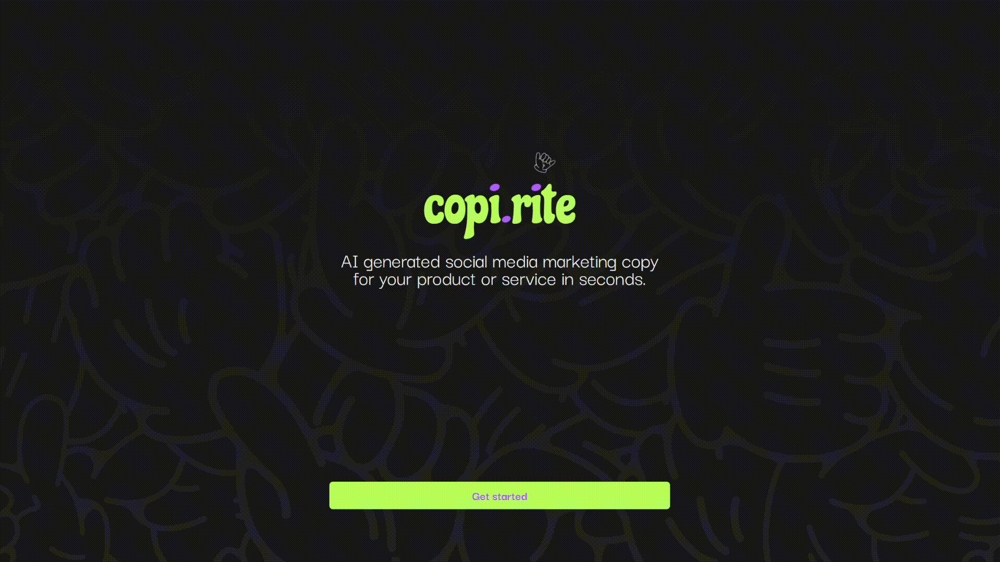

# Copi.Rite

AI generated marketing copy for your product or service, powered by OpenAI API.

## Description

This project uses React, TypeScript, Next.JS, TailwindCSS and the OpenAI API to create a web application that generates marketing copy using AI.

## Features

Have AI write tailored social media content for your business' product or service.
AI generates content about products or services, using bespoke information about your business, targeting 9 social platforms and with 27 different 'tone of voice'.

## Screenshots

## Installation

To install the project, follow these steps:

1. Clone the repository
2. Run `npm install` to install the dependencies

## Dependencies

- node: `20.4.0`
- react: `18.2.14`
- react-dom: `18.2.6`
- autoprefixer: `10.4.14`
- eslint: `8.44.0`
- eslint-config-next: `13.4.9`
- next: `13.4.9`
- openai: `^3.3.0`
- postcss: `8.4.25`
- react: `18.2.0`
- react-dom: `18.2.0`
- tailwindcss: `3.3.2`
- typescript: `5.1.6`

## Usage

To start the development server, run `npm run dev`.

## API Key

To use the OpenAI API, you'll need to obtain an API key from OpenAI and add it to your environment variables. Please refer to the OpenAI documentation for more details.

## Contributing

Pull requests are welcome. For major changes, please open an issue first to discuss what you would like to change.

## License

[MIT](https://choosealicense.com/licenses/mit/)
